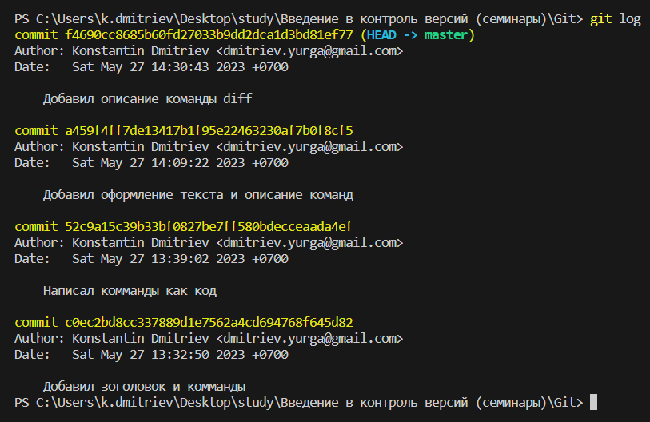

# Основные команды Git #
## Первоначальные настройк Git ##
* Задать имя пользователя ввести команду:
>git config --global user.name "User Name"

* Посмотреть имя пользователя ввести:
>git config --global user.name  

* Задать email пользователя введите команду:
>git config --global user.email user.name@gmail.com  

* Посмотреть email пользователя ввести:
>git config --global user.name

* Показать установленную версию Git
>git -- version

## Основные команды ##
* После открытия каталога с проектом его необходима инициализировать, для этого нужно ввести команду:
>git init  

* Что бы посмотреть состояние рабочего каталога ввести команду:
>git status  

* Для добавление коммита нужно доавить файл в индекс, предворительно сохранив редактируемый файл. Комманда для добавления редактируемого файла в индекс:
>git add 'name.txt' 

* Для добавления всех файлов рабочего каталого в индекс выполнить команду:
>git add . 

* Для того что бы записать проиндексированные измения в репозиторий выполнить команду:
>git commit -m 'комменарий'  

* Добавить файл в отслеживание без команды `add`:
>git commit -am 'коментарий'

Эта команда работает только с файлами ранее доавленными к остслеживанию.

* Для просмотра списка изменений после последней команды `commit` ввести команду:
>git diff

* Для того что бы вывести список коммитов необходимо выполнить команду:
>git log

* Показывает лог в виде дерева
>git log --graph

* Показывает лог кратко в одну строчку
>git log --oneline

* Результа выполнения команды `git log` комманды:

* Для того что бы перейти к какому то коммиту нужно ввести комманду `checkout` с указанием первых четырех символов метки коммита. Например:
>git checkout 52c9

В результате в редакторе отобразится файл с актуальностью на момент сохранного коммита кторый мы выбрали.

* Для возврата в исходный файл необходимо ввести команду:
>git checkout master

## Работа с ветками
* Создание новой ветки:
>git branch NameVetki

* Просмотр веток ранее созданых веток:
>git branch

* Переход к ветке:
>git checkout NameVetki

* Переименовать текущую ветку:
>git branch -m NewNameVetki

* Переименовать ветку из другой ветки
>git branch -m NameVetki NewNameVetki

* Для слияния ветки с веткой мастер, перейти в ветку мастер и выполнить команду:
>git merge NameVetki

При слиянии веток могут произайти конфликты. Конфликт возникает только в том случае если после создания ветки, был создан `commit` в главной ветке, тоесть если после создания ветки бне было изменения в ветке мастре, а было изменение в новой метки, то при слиянии конфликта не будет.

* Удаление ветки
>git branch -d NewBranch

* Создание ветки с одновременным переходом на создаваемую ветку:
> git checkout -b NewBranch

## Работа с удаленными репозиториями
* Для загрузки удаленного репозитория, например с GITHUB необходимо воспользоваться командой:
>git clont https://github.com/ilnar-geekbrains/version_control_lection_3.git

* Для подключения к своему адаленному репозиторию необходимо выполнить комманды:
>git remote add origin https://github.com/k00stya-git/geekbrains_md.git  

    показываем git ссылку на удаленный репозиторий, связываем локалный репозиторий с удаленным  

>git branch -M main  

    показываем какая ветка будет являтся основной  

>git push -u origin main  

    Направляем что есть в локальном репозитории в интернет
    
* Просмотр ссылок на удаленные репозитории:
> git remote show origin

* Изменение ссылки на удаленный репозиторий:
> git remote set-url origin https://github.com/k00stya-git/geekbrains_md.git  

* Отправить локальный репозиторий в интернет
>git push

* Отпрвлка репозитория из другой ветки
>git push --set-upstream origin branch

* Загрузка с удаленного репозитория:
>git pull
